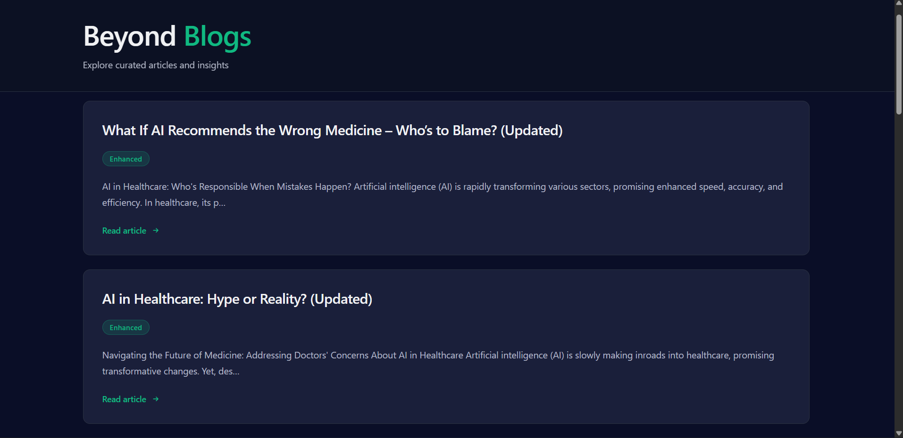
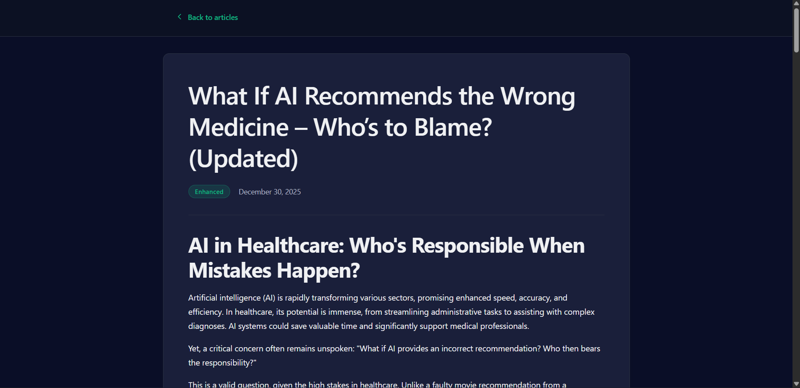

# BeyondChats Assignment — Monorepo (Blogs Scraper + AI Updater + Frontend)

This project is a **monorepo** containing:

✅ Automated blog scraper
✅ AI‑powered article updater (Gemini)
✅ REST API backend
✅ React + Vite frontend blog viewer

It fetches articles, enhances them using AI, and displays both original & updated versions.

---

## 🏗️ Project Structure

```
root
├── backend/
│   ├── src/
│   │   ├── config/
│   │   ├── jobs/
│   │   ├── models/
│   │   ├── modules/
│   │   │   ├── scraper/
│   │   │   └── updater/
│   │   ├── routes/
│   │   ├── utils/
│   │   └── server.ts
│   ├── package.json
│   ├── tsconfig.json
│   └── .env.example
│
├── frontend/
│   ├── src/
│   │   ├── api/
│   │   ├── pages/
│   │   ├── App.tsx
│   │   ├── main.tsx
│   │   └── index.css
│   ├── vite.config.ts
│   ├── package.json
│   └── tsconfig.json
│
├── .gitignore
└── README.md
```

---

## 🔧 Requirements

* Node.js 18+
* MongoDB running locally or in cloud
* Google Custom Search API Key
* Gemini API Key

---

## 🔑 Environment Setup

Create **backend/.env** (use `.env.example`):

```
PORT=5000
MONGO_URI=mongodb://127.0.0.1:27017/beyondblogs

GEMINI_API_KEY=your_key_here

GOOGLE_API_KEY=your_key_here
GOOGLE_CX=your_custom_search_engine_id
```

---

## ▶️ Install Dependencies

### Backend

```
cd backend
npm install
```

### Frontend

```
cd frontend
npm install
```

---

## 🚀 Run the App

### 1️⃣ Start Backend API

```
cd backend
npm run dev
```

Runs on:

```
http://localhost:5000
```

---

### 2️⃣ Start Frontend

```
cd frontend
npm run dev
```

Runs on:

```
http://localhost:5173
```

---

## 🕸 Scrape Original Articles

```
cd backend
npx ts-node src/jobs/runScraper.ts
```

This pulls the blog posts and stores them in MongoDB.

---

## 🤖 AI Update Articles

```
cd backend
npx ts-node src/jobs/runUpdater.ts
```

This:

✔ Finds original articles
✔ Searches the web for context
✔ Uses Gemini to rewrite
✔ Saves updated copies

---

## 🧠 Tech Stack

### Backend

* Node.js
* Express
* MongoDB
* Axios
* Cheerio
* Google Custom Search
* Gemini AI API

### Frontend

* React (Vite)
* TypeScript
* TailwindCSS
* React Router
* Markdown Renderer

---

## 📌 Features

* ✔ Scrape real blogs
* ✔ Clean + sanitize HTML
* ✔ Rewrite using AI
* ✔ Show original vs updated
* ✔ Clean UI layout

---

## 🚀 Deployment Guide

### 🔧 Environment Variables

Create **backend/.env** (use `.env.example` as reference):

```
PORT=5000
MONGO_URI=your_mongodb_connection
GOOGLE_API_KEY=your_google_key
GOOGLE_CX=your_custom_search_engine_id
GEMINI_API_KEY=your_gemini_key
```

### ▶️ Backend Setup

```
cd backend
npm install
npm run build   # if applicable
npm run dev     # or npm start
```

API runs at:

```
http://localhost:5000
```

---

### 🖥 Frontend Setup

```
cd frontend
npm install
npm run dev
```

App runs at:

```
http://localhost:5173   # default Vite port
```

---

## 🌍 Production Deployment (Optional)

### Backend (VPS / Render / Railway / Docker)

* push code to GitHub
* set environment variables in the host
* run build + start script or deploy Docker container

### Frontend (Vercel / Netlify / Static hosting)

```
cd frontend
npm run build
```

Upload the **dist/** folder.

---

## 📸 Screenshots

### 🏠 Blog List Page



### 📄 Article Detail Page




---

## 👤 Author

**Kunal Rathore**